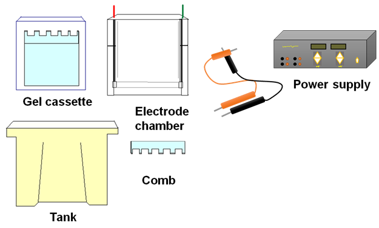
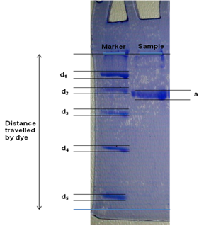
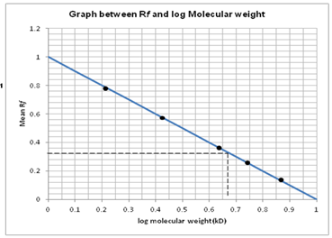
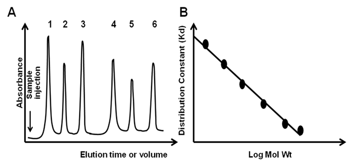
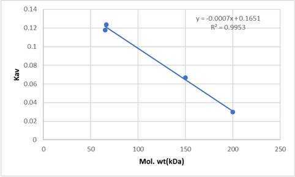

### Procedure

### A. Determination of Sub-unit Molecular weight of given protein by SDS-PAGE

**Sample Analysis by SDS-PAGE:** Sample was resolved on SDS-PAGE as described below. Different components of SDS-PAGE are given in Figure 2.

#### 2.1 Materials Required for SDS-PAGE:

**Buffer and reagent for electrophoresis-** The different buffer and reagents with their purpose for vertical gel electrophoresis is as follows-

1. N, N, N', N'-tetramethylethylenediamine (TEMED)-It catalyzes the acrylamide polymerization.
2. Ammonium persulfate (APS)-It is an initiator for the acrylamide polymerization.
3. Tris-HCl- It is the component of running and gel casting buffer.
4. Glycine- It is the component of running buffer.
5. Bromophenol blue- It is the tracking dye to monitor the progress of gel electrophoresis.
6. Coomassie brilliant blue R250-It is used to stain the polyacrylamide gel.
7. Sodium dodecyl sulphate-It is used to denature and provide negative charge to the protein.
8. Acrylamide- Monomeric unit used to prepare the gel.
9. Bis-acrylamide- Cross linker for polymerization of acrylamide monomer to form gel.

#### 2.2 Casting of PAGE Gels:

1. In a vertical gel electrophoresis system, we cast two types of gels, stacking gel and resolving gel.
2. First the resolving gel solution is prepared and poured into the gel cassette for polymerization.
3. A thin layer of organic solvent (such as butanol or isoproponal) is layered to stop the entry of oxygen (oxygen neutralizes the free radical and slow down the polymerization) and make the top layer smooth.
4. After polymerization of the resolving gel, a stacking gel is poured and comb is fitted into the gel for construction of different lanes for the samples.

<b>Figure 2: Components of Gel Electrophoresis</b>

#### 2.3: Running of SDS-PAGE:

#### 2.4 Determination of denatured molecular weight:

The protein is resolved on SDS-PAGE along with the molecular weight standards (Figure 3).

<b>Figure 3: SDS-PAGE profile of unknown protein along with standard proteins.</b>

1. Resolve the protein sample on the SDS-PAGE along with the molecular weight markers.
2. Calculate the relative mobility (Rf) using the following formula:

<b>Rf = migration of protein from the lane / migration of tracking dye</b>

3. Plot log molecular mass (y-axis) versus relative mobility (x-axis) of the standards.
4. Perform a linear regression using a calculator or using regression software such as Microsoft Excel (Figure 4).
5. Use the linear regression equation (y=mx+c) to estimate the mass of the unknown protein.
   Log Molecular Weight=(slope)(mobility of the unknown)+ Yintercept

<b>Figure 4: Calibration curve of SDS-PAGE. The relationship between Rf and Molecular weight of protein in SDS-PAGE.</b>

### B. Determination of native molecular weight of a protein using gel filtration chromatography

The molecular weight and size of a protein is related to the shape of the molecule and the relationship between molecular weight (M) and radius of gyration (Rg) is as follows-

<b>Rg ∝ Ma…………………………………………Eq 32.4</b>

here “a” is a constant and it depends on shape of the molecule, a=1 for Rod, a=0.5 for coils and a=0.33 for spherical molecules.

The set of known molecular weight standard protein can be run on a gel filitration column and elution volume can be calculated from the chromatogram (Figure 5). A separate run with the analyte will give elution volume for unknown sample. Using following formula, Kd value for all standard protein and the test analyte can be calculated.

<b>Kd=(Ve-Vo)/Vi</b>

A plot of Kd versus log mol wt is given in Figure 5, B and it will allow us to calculate the molecular weight of the unknown analyte

<b>Figure 5: Determination of molecular weight by gel filtration chromatography. (A) Gel filtration chromatogram with the standard proteins (1-6), (B) Relationship between distribution constant (Kd) and Log Molecular weight</b>

1. Column packing-The column material is allowed to swell in the mobile phase. It is poured into the glass tube and allow the beads to settle without trapping air bubble within the column. Once the matrix is settled to give a column, it can be tested for presence of air channel and well packing by flowing a analyte with Kd=1, it is expected that the elution volume (Ve) in this case should be Vo+Vi.
2. Sample Preparation- The sample is prepared in the mobile phase and it should be free of suspended particle to avoid clogging of the column. The most recommended method to apply the sample is to inject the sample with a syringe.
3. Elution- In gel filtration column, no gradient of salt is used to elute the sample from the column. The flow of mobile phase is used to elute the molecules from the column.
4. Column Regeneration- After the analysis of analyte, gel filtration column is washed with the salt containing mobile phase to remove all non-specifically adsorb protein to the matrix. The column is then equiliberated with mobile phase to regenerate the column. The column can be store at 40C in the presence of 20% alchol containing 0.05% sodium azide.

  
Oligomeric Status = $\frac{Molecular Weight (Native)}{Molecular Weight (SDS-PAGE)}$

**Result:**

**SDS-PAGE:** Molecular weight from SDS-PAGE=18kDa

**Gel Filtration Chromatography:**

Observation:

For Molecular weight of unknown protein:

Total volume = 23.562 ml

Void volume = 7.79 ml

For Lysozyme: log MW = 1.15; Ve = 21 ml; Kav = 0.8375

| Sr. No. | Standards             | Mol. wt (kDa) | Log (MW) | Elution Volume |    Kav |
| ------- | --------------------- | ------------: | -------: | -------------: | -----: |
| 1       | β-amylase             |           200 |     2.30 |        8.26 mL | 0.0298 |
| 2       | Bovine Serum Albumin  |          66.4 |     1.82 |        9.74 mL | 0.1236 |
| 3       | Haemoglobin           |            65 |     1.81 |        9.65 mL | 0.1179 |
| 4       | Alcohol Dehydrogenase |           150 |    2.176 |        8.84 mL | 0.0666 |

Elution volume for unknown protein = 19.71 ml

∴Kav for unknown protein = 0.7558

**Calculations:**

Molecular weight of unknown protein:
Consider, From graph,

log (Molecular weight for unknown protein) = 1.515

∴ Molecular weight of unknown protein = 101.245

Molecular weight of unknown protein = **17.579 kDa**

Oligomeric Status (n)=17.57 ÷ 18 = **0.97**

Oligomeric status (n) is a whole number so oligomeric status of the protein is monomer.

---

## Video Demonstration

<table>
  <tr>
    <td>
      
      Determination of denatured molecular weight
    </td>
    <td>
      
      Determination of native molecular weight
    </td>
  </tr>
</table>
